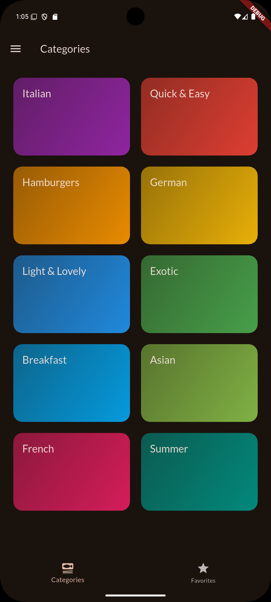
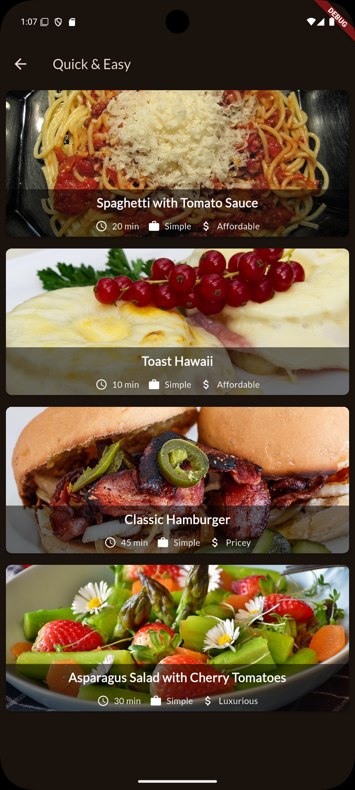
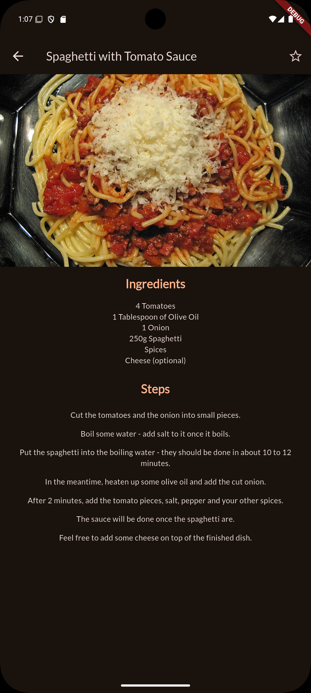
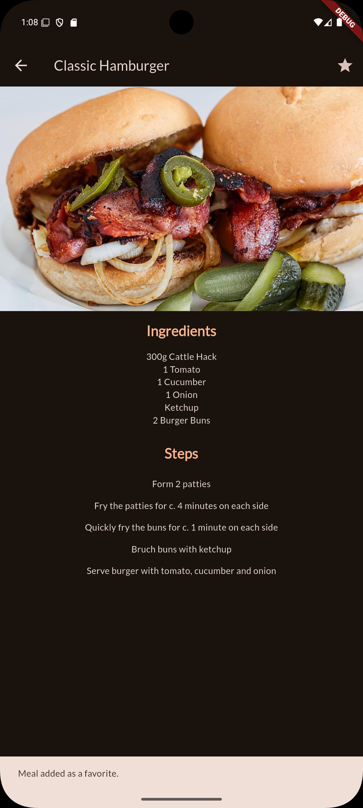
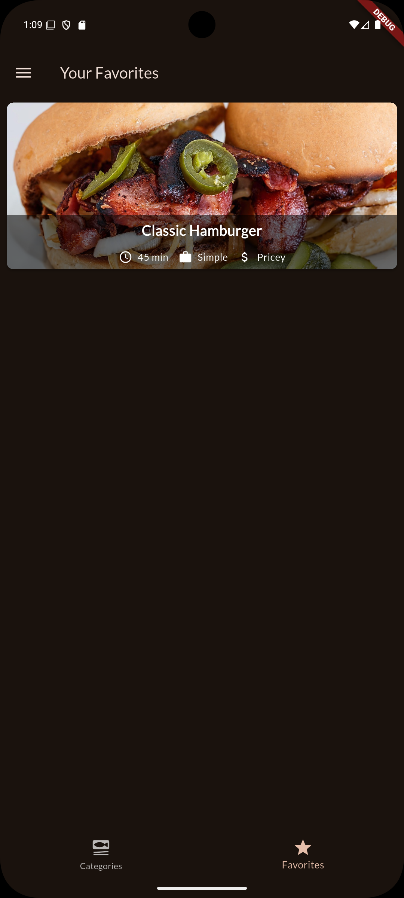
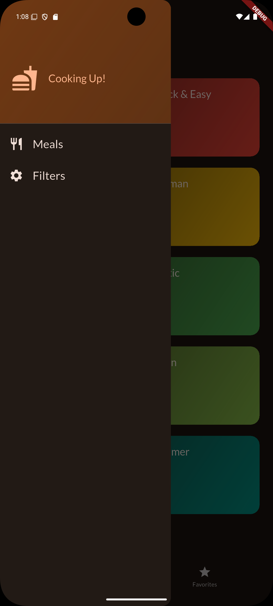
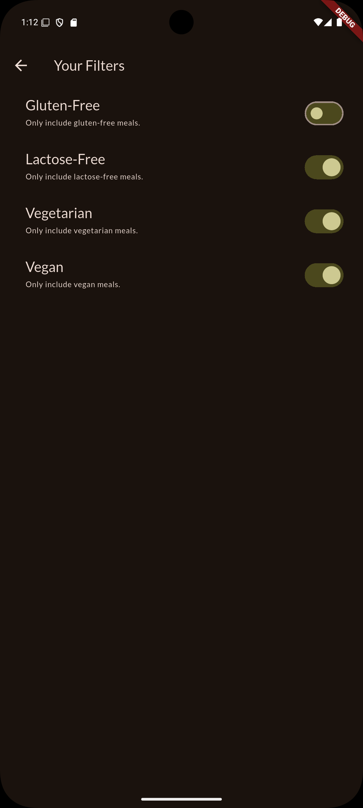
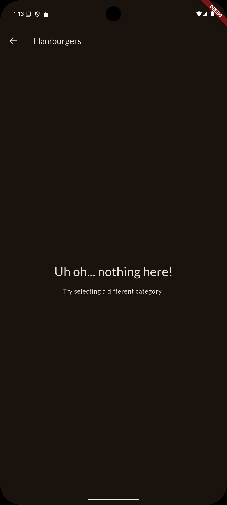

# MEALS_APP

Mobile application developed with **Flutter and Dart** that enables users to explore meals by category, view detailed recipes, mark favorite meals, and filter content based on dietary preferences such as gluten-free, vegetarian, vegan, and lactose-free. The application features a clean, responsive, and user-friendly interface.

## Preview

<div align="center">
<table>
<tr>
  <td colspan="3" align="center">
    <h3>Categories</h3>
  </td>
</tr>

<tr>
  <td></td>
  <td></td>
  <td></td>
</tr>

<tr>
  <td colspan="3" align="center">
    <h3>Favorite Meals</h3>
  </td>
</tr>

<tr>
  <td></td>
  <td></td>
  <td></td>
</tr>

<tr>
  <td colspan="3" align="center">
    <h3>Dietary Filters</h3>
  </td>
</tr>

<tr>
  <td></td>
  <td></td>
  <td></td>
</tr>
</table>
</div>


## Features
- Navigate between Categories and Favorites using the Bottom Navigation Bar
- Browse meals by category
- View detailed meal information, including ingredients and preparation steps
- Mark and manage favorite meals
- Filter meals by dietary preferences:
  - Gluten-free
  - Lactose-free
  - Vegetarian
  - Vegan
- Material 3 design
- Responsive layout for different screen sizes
- State management with Riverpod

## Technologies
- Flutter
- Dart
- Material 3
- Flutter Riverpod
- Google Fonts
- Android

## Test Device

- **Device:** Pixel 8 x86_64
- **Operating System:** Android 15 (Vanilla Ice Cream)

## Installation

1. Clone the repository:
   ```bash
   git clone https://github.com/IsaPortuguez/Meals_App.git

2. Navigate to the project directory:

    ```bash
    cd meals_app

3. Install dependencies:

    ```bash
    flutter pub get

4. Run the application:

    ```bash
    flutter run

## Usage
- Navigate between Categories and Favorites using the Bottom Navigation Bar.
- Browse meals by selecting a category.
- Tap a meal to view its ingredients and preparation steps.
- Mark or remove meals as favorites.
- Apply dietary filters from the Filters screen.
- Explore meals that match your selected preferences.

## Project Structure

```text
MEALS_APP/
├── assets/
│   └── screenshots/                  # Images used in the README
├── lib/
│   ├── data/
│   │   └── dummy_data.dart           # Sample meals and categories
│   ├── models/
│   │   ├── category.dart             # Category model
│   │   └── meal.dart                 # Meal model
│   ├── providers/
│   │   ├── favorites_provider.dart   # Favorites state provider
│   │   ├── filters_provider.dart     # Dietary filters provider
│   │   └── meals_provider.dart       # Available meals provider
│   ├── screens/
│   │   ├── categories.dart           # Categories screen
│   │   ├── filters.dart              # Filters screen
│   │   ├── meal_details.dart         # Meal details screen
│   │   ├── meals.dart                 # Meals list screen
│   │   └── tabs.dart                 # Bottom navigation screen
│   ├── widgets/
│   │   ├── category_grid_item.dart   # Category grid tile
│   │   ├── main_drawer.dart          # Navigation drawer
│   │   ├── meal_item_trait.dart      # Meal attribute widget
│   │   └── meal_item.dart            # Meal list item
│   └── main.dart                     # Application entry point
├── android/                          # Native Android code
├── ios/                              # Native iOS code
├── linux/                            # Linux support
├── macos/                            # macOS support
├── web/                              # Web support
├── windows/                          # Windows support
├── test/                             # Automated tests
│   └── widget_test.dart              # Widget tests
├── .gitignore                        # Files ignored by Git
├── pubspec.yaml                      # Dependencies and project configuration
└── README.md                         # Project documentation
```

## Project Status

✅ Completed (learning project)

## Author

Developed by Isabel Portuguez Calderon
GitHub: https://github.com/IsaPortuguez

## Notes 

This project was created for educational purposes as an introduction to mobile app development using Flutter.

## Acknowledgements

This app was created following a course on Udemy:  
[Flutter & Dart - The Complete Guide [2025 Edition]](https://www.udemy.com/course/learn-flutter-dart-to-build-ios-android-apps/)

Special thanks to the instructor for the guidance.

## Resources

If you're new to Flutter, these resources might help you:

- [Write your first Flutter app](https://docs.flutter.dev/get-started/codelab)
- [Flutter Cookbook](https://docs.flutter.dev/cookbook)
- [Flutter Documentation](https://docs.flutter.dev/)

